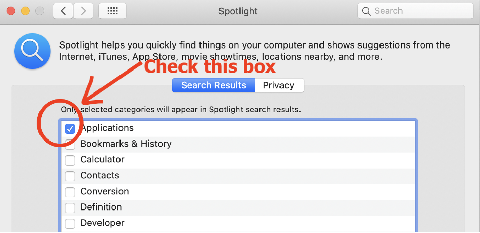

# How to: remote login from MAC  
  
### Step 1:  
To complete this tutorial, an account should have been created for on the Fordham servers and you should have been given a username and password.  If you were not given these credentials, contact your instructor before proceeding to the next step.  My username “cking74” will be used throughout this tutorial along with the password “mypass” which you should remember to replace with your own information.   
  
It is also important to remember on which server your account exists in order to log in. There are two main servers for the department: **storm** located at the Rose Hill campus and **erdos** at the Lincoln Center campus. These are the machines that we will be remotely accessing.   
  
  
### Step 2:  
Next, ensure that your computer is connected to the internet and launch Terminal. Terminal comes pre-installed on Mac computers. It can easily be located by clicking on Spotlight, typing “terminal” into the search bar and double clicking on the top result. 
    
  

If the application does not immediately show up in the Spotlight window, you may need to adjust your search results for Spotlight. This can be done by opening Finder, navigating to the following location and checking the “Applications” box.  
  
**Applications >> System Preferences >> Spotlight >> Search Results**  
  
     

Additionally, Terminal can be found in its original location:  **Applications >> Utilities**  

Once you’ve launched Terminal, a window similar to the following will pop up. This is often referred to as the _command-line_ and we can execute commands on our computer by typing them in here.  

  
  
  
### Step 3:  
Next, we will access the remote servers using the **ssh** (secure shell) command. This command should be executed along with [your user name] @ [your remote machine] as demonstrated in the example below. Note that if your account is on the storm servers, your remote machine is **storm.cis.fordham.edu** and if on the erdos servers, it is **erdos.dsm.fordham.edu**.  
  
Proceed by typing the following command into the terminal (with your own account details) and press **enter**:  

     ssh cking74@storm.cis.fordham.edu
  
  
  
Note that if it is your first time logging on, you may be prompted with a similar message for verification:  

    The authenticity of host 'cking74@storm.cis.fordham.edu' cannot be established. DSA key fingerprint is 
    04:48:30:31:b0:f3:5a:9b:01:9d:b3:a7:38:e2:b1:0c. Are you sure you want to continue connecting (yes/no)?
  
If so, type yes and press **enter**. This is just confirming that you intend to connect to this machine and that a host key will be saved for future verification purposes. Then you will then see something like the following message.  

    Warning: Permanently added 'cking74@storm.cis.fordham.edu' (DSA) to the list of known hosts.
  
  
### Step 4:   
After executing the previous command, you should be prompted for your password. Type in your password- “mypass” and press **Enter**. (Note that as you type your password, it will not be displayed and the cursor will not move forward for security reasons.)  
  
  
  
If it is your first time logging in, it is possible that the system will require you to change your password at this point. If it does, simply follow the prompts as they are given to do so. You can change your password again at any time later on using the **passwd** command, which is covered in the tutorial “Introduction to Linux environment”(NEED TO ADD LINK).   
  
  
### Step 5:  
Once you have successfully logged in, you should see something similar to  

    [cking74@storm ~]$ 
  
appear at the start of the line in the terminal. This indicates that you have successfully logged on to the servers.  
  
  
  
**Congratulations!** You now know how to use Terminal and log on remotely!  
  
For troubleshooting visit:  
[https://www.fordham.edu/info/26517/logging_in](https://www.fordham.edu/info/26517/logging_in)

